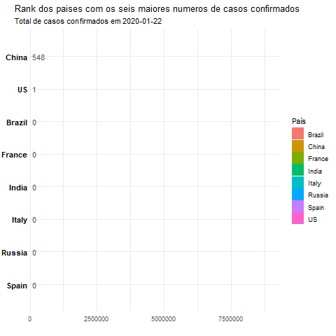
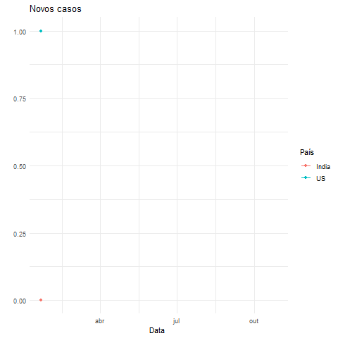
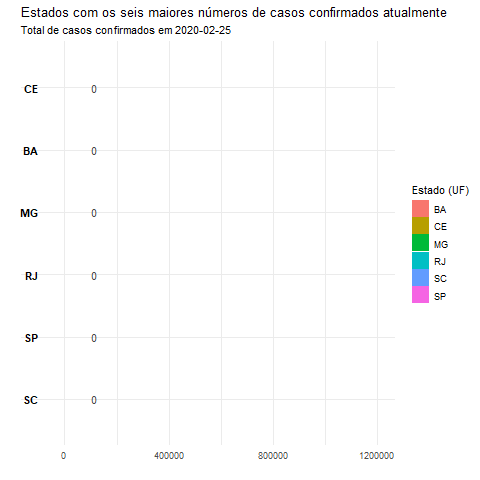
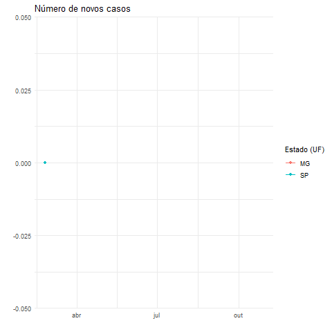

```{r setup, include=FALSE}
library(flexdashboard)
```

```{r Código mundo}
#----------------------------------------------------------------------------------------------
#---------------------------------- Dados Covid-19 - Mundo ------------------------------------
#----------------------------------------------------------------------------------------------

#Carregando os pacotes necessários:
library(rnaturalearth)
library(rnaturalearthdata)
#library(rnaturalearthhires)
library(data.table)
library(tidyverse)
library(rgeos)
library(sf)
#library(fuzzyjoin)
require(gganimate)


# URLs com os dados da Johns Hopkins:
url_confirmed <- "https://data.humdata.org/hxlproxy/api/data-preview.csv?url=https%3A%2F%2Fraw.githubusercontent.com%2FCSSEGISandData%2FCOVID-19%2Fmaster%2Fcsse_covid_19_data%2Fcsse_covid_19_time_series%2Ftime_series_covid19_confirmed_global.csv&filename=time_series_covid19_confirmed_global.csv"
url_deaths <-    "https://data.humdata.org/hxlproxy/api/data-preview.csv?url=https%3A%2F%2Fraw.githubusercontent.com%2FCSSEGISandData%2FCOVID-19%2Fmaster%2Fcsse_covid_19_data%2Fcsse_covid_19_time_series%2Ftime_series_covid19_deaths_global.csv&filename=time_series_covid19_deaths_global.csv"
url_recovered <- "https://data.humdata.org/hxlproxy/api/data-preview.csv?url=https%3A%2F%2Fraw.githubusercontent.com%2FCSSEGISandData%2FCOVID-19%2Fmaster%2Fcsse_covid_19_data%2Fcsse_covid_19_time_series%2Ftime_series_covid19_recovered_global.csv&filename=time_series_covid19_recoverd_global.csv"


# Lendo os dados:
confirmed<-read_csv(url(url_confirmed))
#View(confirmed)
deaths <- read_csv(url(url_deaths))
#View(deaths)
recovered <- read_csv(url(url_recovered))
#View(recovered)

#----------------------------- Processo de manipulação dos dados -----------------------#

# Alterando o formato dos dados (queremos que os dados estejam em um formato "tidy"):
confirmados<- confirmed %>% pivot_longer( cols=-c("Province/State" ,"Country/Region" ,"Lat", "Long") , 
             names_to = "Data", 
             values_to =  "CasosConfirmados")
mortes <- deaths %>% pivot_longer(cols = -c("Province/State", "Country/Region", "Lat", "Long"),
                                        names_to="Data", values_to="Mortes")
recuperados <- recovered %>% pivot_longer(cols = -c("Province/State", "Country/Region", "Lat", "Long"),
                                     names_to="Data", values_to="Recuperados")

#View(confirmados)
#View(mortes)
#View(recuperados)


# Juntando as tabelas (Confirmados, recuperados e mortes) em uma única tabela:
mundo <- confirmados %>% 
  left_join(recuperados, by=c("Country/Region", "Lat", "Long","Data")) %>% 
  left_join(mortes, by=c("Country/Region", "Lat", "Long","Data")) %>% 
  select("Province/State", "Country/Region", "Lat", "Long", "Data",
                         "CasosConfirmados", "Mortes", "Recuperados")
#View(mundo)

teste<-mundo %>% 
  filter(is.na(Recuperados)|is.na(Mortes)) %>% 
  select("Province/State","Country/Region",Data,CasosConfirmados) %>%
  inner_join(mortes,by=c("Province/State",'Country/Region','Data')) %>%
  inner_join(recuperados,by=c("Province/State",'Country/Region','Data'))

auxiliar<-mundo %>% 
  filter(!paste(mundo$`Province/State`,mundo$`Country/Region`,mundo$Data)%in% 
           paste(teste$`Province/State`,teste$`Country/Region`,teste$Data))


teste<-teste %>% select("Province/State",'Country/Region',Lat=Lat.x,Long=Long.y,Data,
                        CasosConfirmados,Mortes,Recuperados)
mundo <-rbind(auxiliar,teste) 
#Renomeando as colunas Province e Country:
mundo<-mundo %>% rename("Province"="Province/State")
mundo<-mundo %>% rename("Country"="Country/Region")
#names(mundo)

# Canada está com os mortos e confirmados por província, mas os recuperados não estão

canada<-filter(mundo,Country=='Canada') %>% 
  group_by(Country,Data) %>% 
  summarise(CasosConfirmados=sum(CasosConfirmados),
            Mortes=sum(Mortes))

recuperados<-rename(recuperados,"Country"="Country/Region")
recuperados<-rename(recuperados,"Province"="Province/State")
cnd_mundo<- canada %>% 
  left_join(recuperados, by=c("Country","Data"))

# Reordenando as colunas

cnd_mundo<- 
  cnd_mundo %>%
  select(Province,Country,Lat,Long,Data,CasosConfirmados,Mortes,Recuperados)
  
# Tirando Canada do banco 'mundo'

mundo <- mundo %>% filter(Country!='Canada')

# Juntando mundo com cnd_mundo

mundo<- add_row(mundo,cnd_mundo)


# É necessário converter a classe da coluna de data para date:
require(lubridate)
#head(mundo$Data)
mundo$Data<-mdy(mundo$Data)
#summary(mundo$Data)

# Banco de dados com os totais mais atuais (será utilizado no mapa).
# No aplicativo, pretendemos colocar um filtro de data. De maneira que utilizar o filtro, o mapa seja de acordo a essa data. 


# A seguir criaremos uma base agrupada por país:
mundo_pais<-mundo %>%
  group_by(Country,Data) %>%
  summarise(
    TotalCasos=sum(CasosConfirmados),
    TotalMortes=sum(Mortes),
    TotalRecuperados=sum(Recuperados)
  )


# A seguir criaremos as colunas novos Casos, novos Recuperados e novos Mortos por dia:
# Falta estruturar melhor essa parte, mas a ideia é essa. 
# Ordenar por pais e data, aplicar o diff por país.
# a tapply retorna uma lista, temos q voltar pro banco
mundo_pais<-mundo_pais[order(mundo_pais$Country,mundo_pais$Data),]
novos<-tapply(mundo_pais$TotalCasos,mundo_pais$Country,diff)

# É necessário colocar o número de casos no dia 1. Porque a função diff exclui esse valor.
# Por enquento faremos assim:
for( i in names(novos)){
  casos_pais<-filter(mundo_pais,Country==i) %>% select(TotalCasos) #Pegando o data frame com o n?mero de casos do pa?s em quest?o.
  novos[[i]]<-c(as.numeric(casos_pais[1,2]),novos[[i]]) #Conacatena o n?mero de caso no pa?s no dia 1 com o vetor de novos casos.
}

# Voltando para o formato de df:
dados3<-plyr::ldply(novos, data.frame)

# Acrescentando a coluna de novos casos no banco:
mundo_pais$NovosCasos<-dados3$X..i..

# Verificando o resultado:
#View(mundo_pais) # Funcionou!

# Iremos repetir o mesmo processo para os novos casos recuperados por dia:
novos<-tapply(mundo_pais$TotalRecuperados,mundo_pais$Country,diff)

for( i in names(novos)){
  casos_pais<-filter(mundo_pais,Country==i) %>% select(TotalRecuperados)
  novos[[i]]<-c(as.numeric(casos_pais[1,2]),novos[[i]])
}

# Voltando para o formato df:
dados3<-plyr::ldply(novos, data.frame)

#Acrescentando a nova coluna no banco:
mundo_pais$NovosRec<-dados3$X..i..

# Iremos repetir o mesmo processo para os novos mortos por dia:
novos<-tapply(mundo_pais$TotalMortes,mundo_pais$Country,diff)


for(i in names(novos)){
  casos_pais<-filter(mundo_pais,Country==i) %>% select(TotalMortes)
  novos[[i]]<-c(as.numeric(casos_pais[1,2]),novos[[i]])
}

# Voltando para o formato df
dados3<-plyr::ldply(novos, data.frame)

# Acrescentado a nova coluna no banco:
mundo_pais$NovosMortos<-dados3$X..i..

#Conferindo o resultado:
#View(mundo_pais)
#summary(mundo_pais$NovosCasos)
```

```{r Código Brasil}
#########################
#  Carregando pacotes   #
#########################
library(dplyr)
library(tidyr)
library(tidyverse)
library(data.table)
library(lubridate)
library(gganimate)
library(rio)
library(httr)
library(jsonlite)
library(rgdal)  
library(brmap)  
#library(geobr)
#########################

#### Brasil ####

###################################
#   Manipulando o banco de dados  #
###################################

# url para baixar os dados:
url <-  "https://xx9p7hp1p7.execute-api.us-east-1.amazonaws.com/prod/PortalGeral"
covid <- httr::GET(url, 
             add_headers("x-parse-application-id" = "unAFkcaNDeXajurGB7LChj8SgQYS2ptm"))

# Resultado:
results <- covid %>% 
  httr::content()

#results

# url para baixar os dados:
url_data <- results$results[[1]]$arquivo$url
#url_data


if(str_detect(url_data, ".rar")){
  file_name <- paste0(getwd(),"/data/covid.rar")
  download.file(url_data, destfile = file_name)
  out <- archive(file_name)
  archive_extract(out, "data")
  dados <- rio::import(paste0("data/", out$path)) %>% 
    as_tibble()
} else if (str_detect(url_data, "xlsx")){
  dados <- rio::import(url_data, readxl =F, detectDates = T) %>% 
    as_tibble()
} else{
  dados <- rio::import(url_data) %>% 
    as_tibble()
}

ultima_atualizacao <- results$results[[1]]$dt_atualizacao

#View(dados)

#### Calculo do numero do dia ####
data_inicial_pandemia_br <- as.character(ymd(dados[[1,'data']]))
data_atual_pandemia_br <- ymd(today())
periodo <- data_inicial_pandemia_br%--%data_atual_pandemia_br

qnt_dias <- as.numeric(periodo, "days") + 1
qnt_meses <- as.numeric(str_sub(as.period(periodo, "month"), start = 1, end=1))

# Vemos que as primeiras linhas s?o referentes a apenas os valores para o Brasil:
# Depois s?o os dados de cada estado
# Apos isso, temos os dados de cada municipio

# Iremos utilizar no trabalho os dados do Brasil como um todo, de cada estado e para 
# fazer uma analise mais detalhada par ao Brasil. Ent?o vamos separar dados em:

# - dados_brasil: dados contendos os totais do brasil
# - dados_estados: dados contendo detalhes dos estados
# - dados_mg: dados contendo detalhes de minas e municipios


#### Dados Brasil: ####

#E possivel perceber que os dados para o Brasil s?o todos com coduf = 76
dados_brasil <- filter(dados, coduf==76)

#### Dados Estados ###

#numero da linha inicial do banco estados:
inicio_est <- qnt_dias + 1
final_est <- (inicio_est + (qnt_dias*27))-1 #sao 27 estados

#Tem um problema que RO repete ap?s a linha 6021 a parit da linha 6021 na data atual.
# Ent?o, dados do estado vai at? final_est
dados_estado <- dados[inicio_est:(final_est-1),]
#dados_estado[nrow(dados_estado)]
#View(dados_estado)

#### Nivel municipio ####

# mun<-read_municipality(year = 2019,
#   showProgress = F)
# dados_mun <- dados %>% filter(municipio != "" & estado != "")
# dados_mun$codmun <- as.numeric(dados_mun$codmun)
# dados_mun <- left_join(dados_mun, mun, by = c("codmun"="code_muni"))

#View(dados_mg_mun)
#dim(dados_mg_mun)

# Em MG, os dados a nivel de municipio come?am em 27/03/2020
# Modificando o periodo do dia:
# data_inicial_pandemia_mg <- as.character(ymd(dados_mg_mun[[1,'data']]))
# data_atual_pandemia_mg <- ymd(today()-1)
# periodo_mg <- data_inicial_pandemia_mg%--%data_atual_pandemia_mg
# 
# qnt_dias_mg <- as.numeric(periodo_mg, "days") + 1


# #checando a quantidade de dados por municipio:
# check_mg <- dados_mg_mun %>%
#   group_by(municipio) %>%
#   summarise(contagem = length(municipio))
# ifelse(nrow(dados_mg_mun) == 853*qnt_dias_mg, "Dados ok", "Dados Errados")
# ifelse(nrow(filter(check_mg, contagem != 184)) == 0, "Dados ok", "Dados Errados")
# 
# #### Excluir a base inteira ####
# rm("dados", "check_mg")

dados_estado$data <- ymd(dados_estado$data)

dados_mapa <- dados_estado %>% 
  left_join(brmap_estado, by = c("coduf" = "estado_cod"))

rm(dados)
```


# Mapa e Gráficos {data-navmenu="Mundo"}


## Painel de filtros {.sidebar}

```{r}
inputPanel(
  selectInput('tipo_plot',label=h4('Selecione uma informação para o mapa'), choices = list('Total de casos confirmados'=1,'Total de mortos'=2,'Total de recuperados'=3),selected = 1)
  )

inputPanel(
  selectInput('pais',label=h4('Selecione um país'), choices = c('Todos',levels(as.factor(mundo_pais$Country))))
  )

inputPanel(
  dateInput('data',label=h4('Selecione uma data'),value = max(mundo$Data),max =max(mundo$Data), min =min(mundo$Data))
  )

```


```{r Fazendo os bancos reativos - Mundo}

dados_data<- reactive({
    mundo %>% 
  filter(Data==input$data)
})


dados_pais<- reactive({
  if(input$pais =='Todos'){
    mundo_pais} else {
      
   mundo_pais %>% 
  filter(Country==input$pais)
    } 
})

dados_cartao<-reactive({
  if(input$pais =='Todos'){
    dados_data()} else {
      
   dados_data() %>% 
  filter(Country==input$pais)
    } 
})

```

## Cartoes

```{r casos d1}
dias_caso1<-reactive({
  if(input$pais =='Todos'){
  b<- mundo %>% 
  filter(Data<=input$data)} else {
  b<- mundo %>% 
  filter(Data<=input$data,Country==input$pais)
    }
  
  
  a<- b %>% filter(CasosConfirmados!=0)
  return((min(a$Data)%--%max(a$Data))/ddays(1))
})
```


### Dias desde o 1º caso
```{r}
renderValueBox(valueBox(dias_caso1()))

```

### Total de casos

```{r}
renderValueBox(valueBox(sum(dados_cartao()$CasosConfirmados)))
```

### Total de mortes

```{r}
renderValueBox(valueBox(sum(dados_cartao()$Mortes)))
```

### Total de recuperados

```{r}
renderValueBox(valueBox(sum(dados_cartao()$Recuperados)))
```


## Mapa

```{r Preparação dos dados - Mundo}
world <- ne_countries(scale = "medium", returnclass = "sf")

mapa_g<-reactive({
  aux<-  dados_data() %>% 
  st_as_sf(coords = c("Long", "Lat"))%>% 
  st_set_crs("+proj=longlat +datum=WGS84")
  aux$geom<-world$name[st_nearest_feature(aux$geometry, world$geometry)]
  aux$geometry<-world$geometry[st_nearest_feature(aux$geometry,world$geometry)] 
  aux2<-
   aux %>% group_by(geom) %>%
   summarise(
   Casos=sum(CasosConfirmados),
     Mortes=sum(Mortes),
   Recuperados= sum(Recuperados))
  aux2<- rename(aux2,Territorio=geom)
  return(aux2)
  
})

```

```{r}
require(plotly)

renderPlotly({
    
    if (input$tipo_plot ==1){
    conf1<-ggplot()+
      geom_sf(data=world,fill='white')+
      geom_sf(data=mapa_g(),aes(label=Territorio,geometry=geometry,fill=Casos))+
      theme_classic()+
      ggtitle(paste('Total de casos até o dia',input$data))
      plotly::ggplotly(conf1, tooltip = c("Casos",'Territorio'))
    }else if (input$tipo_plot ==2){
      conf1<-ggplot()+
        geom_sf(data=world,fill='white')+
        geom_sf(data=mapa_g(),aes(label=Territorio,geometry=geometry,fill=Mortes))+
        theme_classic()+
        ggtitle(paste('Total de mortos até o dia',input$data))
  
      plotly::ggplotly(conf1, tooltip = c("Mortes",'Territorio'))
    }else if (input$tipo_plot ==3){
      conf1<-ggplot()+
        geom_sf(data=world,fill='white')+
        geom_sf(data=mapa_g(),aes(label=Territorio,geometry=geometry,fill=Recuperados))+
        theme_classic()+
        ggtitle(paste('Total de recuperados até o dia',input$data))
  
      plotly::ggplotly(conf1, tooltip = c("Recuperados",'Territorio'))
    }

})


```


## Graficos

```{r Dados para gráficos - Mundo}
 d<-reactive({
   a<- dados_pais() %>% 
     filter(Data<=input$data) %>% 
     group_by(Data) %>% 
     summarise(NovosMortos=sum(NovosMortos),
               NovosCasos=sum(NovosCasos),
               NovosRec=sum(NovosRec))
   return(a)
 })
```


### Novos confirmados

```{r}
 renderPlotly({
   g<- ggplot(d(),aes(x=Data,y=NovosCasos))+
     geom_line(col='darkblue')+
     theme_classic()
   ggplotly(g)
 })
```


### Novos mortos

```{r}
 renderPlotly({
   
   g<- ggplot(d(),aes(x=Data,y=NovosMortos))+
     geom_line(col='darkblue')+
     theme_classic()
   ggplotly(g)
 })
```


### Novos recuperados

```{r}
 renderPlotly({
   g<- ggplot(d(),aes(x=Data,y=NovosRec))+
     geom_line(col='darkblue')+
     theme_classic()
   ggplotly(g)
 })
```


# Animações e Twitter {data-navmenu="Mundo"}


Row {data-height=650}
-------------------------------------

###


### 



```{r include=FALSE}
 library(twitteR)
 library(wordcloud2)
 library(stringr)
 
 akey<-'SNjqQpunmVROj78bpSrbXaY42'
 asecret<-'JPA5NePjI1wchJ5tTA7S94LEskmuMWb8bCIJBQa4ozECcze8x6'
 atoken<-'588512062-cnhAyXUANA71u9isu5Smr490l4e8ebOb5eePpDBQ'
 atokenSecret<-'HKEsqOh6Kix50iYcunURpdLJBFo8MSRU2QMKmhQDINjJ6'
 setup_twitter_oauth(akey,asecret,atoken,atokenSecret)
 1
 #pesquisar assunto ou hashtag
 p<-searchTwitter('covid19',n=1000,lang="en", resultType = 'recent')
 dfp<-twListToDF(p)
 dfp$text<-str_to_lower(dfp$text)
 
 
 lista_palavras <- strsplit(dfp$text, "\\W+")
 vetor_palavras <- unlist(lista_palavras)
 library(tm)
 library(SnowballC)
 word.corpus <- Corpus(VectorSource(vetor_palavras)) 
 
 ##
 
 word.corpus<-word.corpus%>%
   tm_map(removePunctuation)%>% ##eliminar pontuacao
   tm_map(removeNumbers)%>% #sem numeros
   tm_map(stripWhitespace)# sem espacos
 
 word.corpus<-word.corpus%>%
   tm_map(tolower)%>% ##make all words lowercase
   tm_map(removeWords, stopwords("en"))
 
 word.corpus <- tm_map(word.corpus, stemDocument)
 word.corpus <- tm_map(word.corpus, removeWords, c("https"))
 word.counts <- as.matrix(TermDocumentMatrix(word.corpus))
 word.freq2 <- sort(rowSums(word.counts), decreasing = TRUE)
 word.freq2<- rownames_to_column(as.data.frame(word.freq2))
 head(word.freq2)
 #frequencia_palavras <- table(vetor_palavras)
 #frequencia_ordenada_palavras <- sort(frequencia_palavras, decreasing=TRUE)
 library(wordcloud)
```

Row {data-height=650}
-------------------------------------

###
```{r}
  wordcloud2(word.freq2, size = 1,color = "random-light", backgroundColor = "black")
 
 library(htmlwidgets)
 #install.packages("webshot")
 #webshot::install_phantomjs()
 #library(wordcloud2)
 #hw = wordcloud2(demoFreq,size = 3)
 #saveWidget(hk,"1.html",selfcontained = F)
 #webshot::webshot("1.html","1.png",vwidth = 700, vheight = 500, delay =10)
```


# Mapa e Gráficos {data-navmenu="Brasil"}

## Painel de filtros {.sidebar}

```{r}
inputPanel(
  selectInput('tipo_plot2',label=h4('Selecione uma informação para o mapa'), choices = list('Total de casos confirmados'=1,'Total de mortos'=2),selected = 1)
  )

inputPanel(
  selectInput('estado',label=h4('Selecione um estado'), choices = c('Todos',levels(as.factor(dados_estado$estado))))
  )

inputPanel(
  dateInput('data2',label=h4('Selecione uma data'),value = max(dados_estado$data),max =max(dados_estado$data), min =min(dados_estado$data))
  )

```


```{r Fazendo os bancos reativos - Brasil}
dados_data_mapa <- reactive({
  dados_mapa %>%
  filter(data == input$data2) %>%
  as.tibble()
})

dados_data_estado <- reactive({
  if(input$estado =='Todos'){
    dados_estado%>%
      filter(data<=input$data2)%>%
      group_by(data) %>% 
      summarise(NovosMortos=sum(obitosNovos),
             NovosCasos=sum(casosNovos))
    } else {
   dados_estado %>% 
     filter(estado==input$estado&data<=input$data2)%>%
     group_by(data) %>% 
     summarise(NovosMortos=sum(obitosNovos),
               NovosCasos=sum(casosNovos))
 } 
}) 
```

## Cartoes

### c1
```{r}
renderValueBox(valueBox('2020-xx-xx','Data caso'))

```

### c2

```{r}
renderValueBox(valueBox(899999,'Número de casos'))
```

### c2

```{r}
renderValueBox(valueBox(899999,'Número de casos'))
```

### c2

```{r}
renderValueBox(valueBox(899999,'Número de casos'))
```

### c2

```{r}
renderValueBox(valueBox(899999,'Número de casos'))
```

## Mapa


```{r}
library(plotly)

renderPlotly({
    
    if (input$tipo_plot2 == 1){
    conf1<-ggplot() + 
    geom_sf(data=dados_data_mapa(),aes(geometry=geometry, fill= casosAcumulado, label=estado))+
    theme_classic()+
    ggtitle(paste('Total de casos até o dia',input$data2))
    
    plotly::ggplotly(conf1, tooltip = c("Casos",'Estado'))
    
    }else if (input$tipo_plot2 == 2){
      conf1<-ggplot() + 
    geom_sf(data=dados_data_mapa(),aes(geometry=geometry, fill= obitosAcumulado, label=estado))+
    theme(
    panel.background = element_blank(), 
    panel.grid.major = element_line(color = "transparent"), 
    axis.text = element_blank(), 
    axis.ticks = element_blank(),
    plot.title = element_text(hjust = 0.5) ## hjus = 0.5 centraliza o título
  )+
    ggtitle(paste('Total de mortes até o dia',input$data2))
      
    plotly::ggplotly(conf1, tooltip = c("Mortes",'Estado'))
    }

})
```


## Graficos

### Novos confirmados

```{r}
 renderPlotly({
   g<- ggplot(dados_data_estado(),aes(x=data,y=NovosCasos))+
     geom_line(col='darkblue')+
     theme_classic()
   ggplotly(g)
 })
```


### Novos mortos

```{r}
 renderPlotly({
   
   g<- ggplot(dados_data_estado(),aes(x=data,y=NovosMortos))+
     geom_line(col='darkblue')+
     theme_classic()
   ggplotly(g)
 })
```


# Animações e Twitter {data-navmenu="Brasil"}

Row {data-height=650}
-------------------------------------
###


###



```{r include=FALSE}
 library(twitteR)
 library(wordcloud2)
 library(stringr)
 
 akey<-'SNjqQpunmVROj78bpSrbXaY42'
 asecret<-'JPA5NePjI1wchJ5tTA7S94LEskmuMWb8bCIJBQa4ozECcze8x6'
 atoken<-'588512062-cnhAyXUANA71u9isu5Smr490l4e8ebOb5eePpDBQ'
 atokenSecret<-'HKEsqOh6Kix50iYcunURpdLJBFo8MSRU2QMKmhQDINjJ6'
 setup_twitter_oauth(akey,asecret,atoken,atokenSecret)
 1
 #pesquisar assunto ou hashtag
 p<-searchTwitter('covid19',n=1000,lang="pt", resultType = 'recent')
 dfp<-twListToDF(p)
 dfp$text<-str_to_lower(dfp$text)
 
 
 lista_palavras <- strsplit(dfp$text, "\\W+")
 vetor_palavras <- unlist(lista_palavras)
 library(tm)
 library(SnowballC)
 word.corpus <- Corpus(VectorSource(vetor_palavras)) 
 
 ##
 
 word.corpus<-word.corpus%>%
   tm_map(removePunctuation)%>% ##eliminar pontuacao
   tm_map(removeNumbers)%>% #sem numeros
   tm_map(stripWhitespace)# sem espacos
 
 word.corpus<-word.corpus%>%
   tm_map(tolower)%>% ##make all words lowercase
   tm_map(removeWords, stopwords("por"))
 
 word.corpus <- tm_map(word.corpus, stemDocument)
 word.corpus <- tm_map(word.corpus, removeWords, c("https"))
 word.counts <- as.matrix(TermDocumentMatrix(word.corpus))
 word.freq3 <- sort(rowSums(word.counts), decreasing = TRUE)
 word.freq3<- rownames_to_column(as.data.frame(word.freq3))
 head(word.freq3)
 #frequencia_palavras <- table(vetor_palavras)
 #frequencia_ordenada_palavras <- sort(frequencia_palavras, decreasing=TRUE)
 library(wordcloud)
```

Row {data-height=650}
-------------------------------------

###
```{r}
 hw = wordcloud2(word.freq3,  size = 1,color = "random-light", backgroundColor = "black")
 
 library(htmlwidgets)
 #install.packages("webshot")
 #webshot::install_phantomjs()
 #library(wordcloud2)
 #wordcloud2(word.freq3,size = 0.5)
 
saveWidget(hw,"1.html",selfcontained = F)
webshot::webshot("1.html","1.png",vwidth = 700, vheight = 500, delay =10)
```


